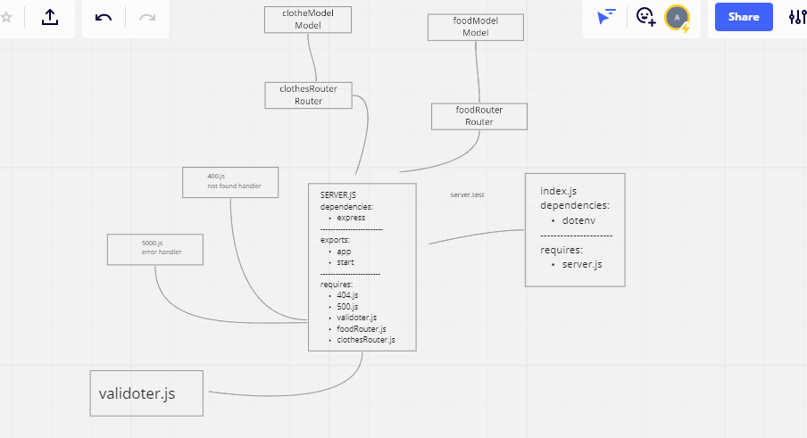

# api-server

**Lab 4 : I have created Dynamic API which through I Add Persistence (Database) to my API**

Heroko URl: Deployment didnot work with the local database.
GitHub Actions: https://github.com/Sokiyna/api-server/actions
PR in GitHub: https://github.com/Sokiyna/api-server/pull/1